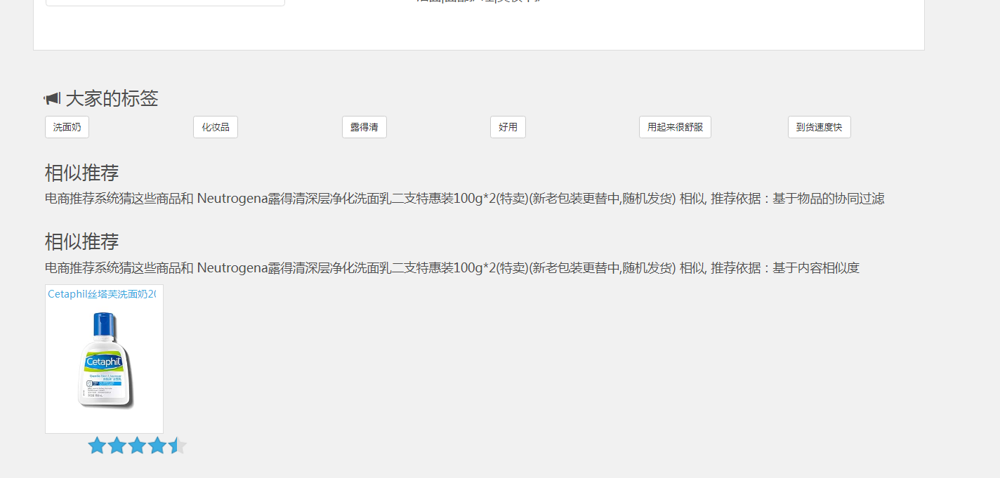

## 计算机毕业设计hadoop+spark商品推荐系统 电商推荐系统 图书推荐系统 机器学习 深度学习 人工智能 大数据毕业设计 Flume Kafka 数据可视化 PySpark Hadoop Hive Hadoop PySpark 机器学习 深度学习 Python Scrapy分布式爬虫 机器学习 大数据毕业设计 数据仓库 大数据毕业设计 文本分类 LSTM情感分析 大数据毕业设计 知识图谱 大数据毕业设计 预测系统 实时计算 离线计算 数据仓库 人工智能 神经网络

## 要求
### 源码有偿！一套(论文 PPT 源码+sql脚本+教程)

### 
### 加好友前帮忙start一下，并备注github有偿电商推荐2025
### 我的QQ号是2827724252或者798059319或者 1679232425或者微信:bysj2023nb 或bysj1688

# 

### 加qq好友说明（被部分 网友整得心力交瘁）：
    1.加好友务必按照格式备注
    2.避免浪费各自的时间！
    3.当“客服”不容易，repo 主是体面人，不爆粗，性格好，文明人。

演示视频
https://www.bilibili.com/video/BV1Cw4m1e7hG/?spm_id_from=333.999.0.0

## 开发技术：
设计文档
1 项目系统架构
项目以推荐系统建设领域知名的经过修改过的中文亚马逊电商数据集作为依托，以某电商网站真实业务数据架构为基础，构建了符合教学体系的一体化的电商推荐系统，包含了离线推荐与实时推荐体系，综合利用了协同过滤算法以及基于内容的推荐方法来提供混合推荐。提供了从前端应用、后台服务、算法设计实现、平台部署等多方位的闭环的业务实现。

用户可视化：主要负责实现和用户的交互以及业务数据的展示，主体采用AngularJS2进行实现，部署在Apache服务上。
综合业务服务：主要实现JavaEE层面整体的业务逻辑，通过Spring进行构建，对接业务需求。部署在Tomcat上。
【数据存储部分】
业务数据库：项目采用广泛应用的文档数据库MongDB作为主数据库，主要负责平台业务逻辑数据的存储。
缓存数据库：项目采用Redis作为缓存数据库，主要用来支撑实时推荐系统部分对于数据的高速获取需求。
【离线推荐部分】
离线统计服务：批处理统计性业务采用Spark Core + Spark SQL进行实现，实现对指标类数据的统计任务。
离线推荐服务：离线推荐业务采用Spark Core + Spark MLlib进行实现，采用ALS算法进行实现。
【实时推荐部分】
日志采集服务：通过利用Flume-ng对业务平台中用户对于商品的一次评分行为进行采集，实时发送到Kafka集群。
消息缓冲服务：项目采用Kafka作为流式数据的缓存组件，接受来自Flume的数据采集请求。并将数据推送到项目的实时推荐系统部分。
实时推荐服务：项目采用Spark Streaming作为实时推荐系统，通过接收Kafka中缓存的数据，通过设计的推荐算法实现对实时推荐的数据处理，并将结构合并更新到MongoDB数据库。

2 项目数据流程
 
【系统初始化部分】
0.通过Spark SQL将系统初始化数据加载到MongoDB中。
【离线推荐部分】
1.可以通过Azkaban实现对于离线统计服务以离线推荐服务的调度，通过设定的运行时间完成对任务的触发执行。
2.离线统计服务从MongoDB中加载数据，将【商品平均评分统计】、【商品评分个数统计】、【最近商品评分个数统计】三个统计算法进行运行实现，并将计算结果回写到MongoDB中；离线推荐服务从MongoDB中加载数据，通过ALS算法分别将【用户推荐结果矩阵】、【影片相似度矩阵】回写到MongoDB中。
【实时推荐部分】
3.Flume从综合业务服务的运行日志中读取日志更新，并将更新的日志实时推送到Kafka中；Kafka在收到这些日志之后，通过kafkaStream程序对获取的日志信息进行过滤处理，获取用户评分数据流【UID|MID|SCORE|TIMESTAMP】，并发送到另外一个Kafka队列；Spark Streaming监听Kafka队列，实时获取Kafka过滤出来的用户评分数据流，融合存储在Redis中的用户最近评分队列数据，提交给实时推荐算法，完成对用户新的推荐结果计算；计算完成之后，将新的推荐结构和MongDB数据库中的推荐结果进行合并。
【业务系统部分】
4.推荐结果展示部分，从MongoDB中将离线推荐结果、实时推荐结果、内容推荐结果进行混合，综合给出相对应的数据。
5.商品信息查询服务通过对接MongoDB实现对商品信息的查询操作。
6.商品评分部分，获取用户通过UI给出的评分动作，后台服务进行数据库记录后，一方面将数据推动到Redis群中，另一方面，通过预设的日志框架输出到Tomcat中的日志中。
7.商品标签部分，项目提供用户对商品打标签服务。

3 数据模型

1.Product【商品数据表】
字段名	字段类型	字段描述	字段备注
productId	Int	商品的ID	
name	String	商品的名称	
categories	String	商品所属类别	每一项用“|”分割
imageUrl	String	商品图片的URL	
tags	String	商品的UGC标签	每一项用“|”分割
 
2.Rating【用户评分表】
字段名	字段类型	字段描述	字段备注
userId	Int	用户的ID	
productId	Int	商品的ID	
score	Double	商品的分值	
timestamp	Long	评分的时间	

3.Tag【商品标签表】
字段名	字段类型	字段描述	字段备注
userId	Int	用户的ID	
productId	Int	商品的ID	
tag	String	商品的标签	
timestamp	Long	评分的时间	
 
4.User【用户表】
字段名	字段类型	字段描述	字段备注
userId	Int	用户的ID	
username	String	用户名	
password	String	用户密码	
timestamp	Lon0067	用户创建的时间	
 
5.RateMoreProductsRecently【最近商品评分个数统计表】
字段名	字段类型	字段描述	字段备注
productId	Int	商品的ID	
count	Int	商品的评分数	
yearmonth	String	评分的时段	yyyymm
 

6.RateMoreProducts【商品评分个数统计表】
字段名	字段类型	字段描述	字段备注
productId	Int	商品的ID	
count	Int	商品的评分数	
 
7.AverageProductsScore【商品平均评分表】
字段名	字段类型	字段描述	字段备注
productId	Int	商品的ID	
avg	Double	商品的平均评分	
 
8.ProductRecs【商品相似性矩阵】
字段名	字段类型	字段描述	字段备注
productId	Int	商品的ID	
recs	Array[(productId:Int,score:Double)]	该商品最相似的商品集合	
 
9.UserRecs【用户商品推荐矩阵】
字段名	字段类型	字段描述	字段备注
userId	Int	用户的ID	
recs	Array[(productId:Int,score:Double)]	推荐给该用户的商品集合	
 
10.StreamRecs【用户实时商品推荐矩阵】
字段名	字段类型	字段描述	字段备注
userId	Int	用户的ID	
recs	Array[(productId:Int,score:Double)]	实时推荐给该用户的商品集合	

4 设计思想
离线统计推荐模块

1.历史热门商品统计
统计所有历史数据中每个商品的评分数
select productId, count(productId) as count from ratings group by productId order by count desc
→ RateMoreProducts
RateMoreProducts 数据结构：productId，count

2.近期热门商品统计
统计每月的商品评分个数，就代表了商品近期的热门度
select productId, score, changeDate(timestamp) as yearmonth from ratings
→  ratingOfMonth
select productId, count(productId) as count ,yearmonth from ratingOfMonth group by yearmonth, productId order by yearmonth desc,count desc
→   RateMoreRecentlyProducts
changDate ：UDF函数，使用 SimpleDateFormat 对 Date 进行格式转化，转化格式为“yyyyMM”
RateMoreRecentlyProducts 数据结构：productId，count，yearmonth

3.商品平均评分统计
select productId, avg(score) as avg from ratings group by productId order by avg desc
  →	 AverageProducts
AverageProducts 数据结构：productId，avg

基于LFM的离线推荐模块
4.用ALS算法训练隐语义模型（LFM）

5.计算用户推荐矩阵

6.计算商品相似度矩阵

实时推荐模块
1.实时推荐模型算法设计
当用户u 对商品p 进行了评分，将触发一次对u 的推荐结果的更新。由于用户u 对商品p 评分，对于用户u 来说，他与p 最相似的商品们之间的推荐强度将发生变化，所以选取与商品p 最相似的K 个商品作为候选商品。
每个候选商品按照“推荐优先级”这一权重作为衡量这个商品被推荐给用户u 的优先级。
这些商品将根据用户u 最近的若干评分计算出各自对用户u 的推荐优先级，然后与上次对用户u 的实时推荐结果的进行基于推荐优先级的合并、替换得到更新后的推荐结果。
具体来说：
首先，获取用户u 按时间顺序最近的K 个评分，记为RK；获取商品p 的最相似的K 个商品集合，记为S；
然后，对于每个商品qS ，计算其推荐优先级，计算公式如下：
 
    其中：
表示用户u 对商品r 的评分；
sim(q,r)表示商品q 与商品r 的相似度，设定最小相似度为0.6，当商品q和商品r 相似度低于0.6 的阈值，则视为两者不相关并忽略；
sim_sum 表示q 与RK 中商品相似度大于最小阈值的个数；
incount 表示RK 中与商品q 相似的、且本身评分较高（>=3）的商品个数；
recount 表示RK 中与商品q 相似的、且本身评分较低（<3）的商品个数；
公式的意义如下：
首先对于每个候选商品q，从u 最近的K 个评分中，找出与q 相似度较高（>=0.6）的u 已评分商品们，对于这些商品们中的每个商品r，将r 与q 的相似度乘以用户u 对r 的评分，将这些乘积计算平均数，作为用户u 对商品q 的评分预测即
 
然后，将u 最近的K 个评分中与商品q 相似的、且本身评分较高（>=3）的商品个数记为 incount，计算lgmax{incount,1}作为商品 q 的“增强因子”，意义在于商品q 与u 的最近K 个评分中的n 个高评分(>=3)商品相似，则商品q 的优先级被增加lgmax{incount,1}。如果商品 q 与 u 的最近 K 个评分中相似的高评分商品越多，也就是说n 越大，则商品q 更应该被推荐，所以推荐优先级被增强的幅度较大；如果商品q 与u 的最近K 个评分中相似的高评分商品越少，也就是n 越小，则推荐优先级被增强的幅度较小；
而后，将u 最近的K 个评分中与商品q 相似的、且本身评分较低（<3）的商品个数记为 recount，计算lgmax{recount,1}作为商品 q 的“削弱因子”，意义在于商品q 与u 的最近K 个评分中的n 个低评分(<3)商品相似，则商品q 的优先级被削减lgmax{incount,1}。如果商品 q 与 u 的最近 K 个评分中相似的低评分商品越多，也就是说n 越大，则商品q 更不应该被推荐，所以推荐优先级被减弱的幅度较大；如果商品q 与u 的最近K 个评分中相似的低评分商品越少，也就是n 越小，则推荐优先级被减弱的幅度较小；
最后，将增强因子增加到上述的预测评分中，并减去削弱因子，得到最终的q 商品对于u 的推荐优先级。在计算完每个候选商品q 的后，将生成一组<商品q 的ID, q 的推荐优先级>的列表updatedList：
 
而在本次为用户u 实时推荐之前的上一次实时推荐结果Rec 也是一组<商品m,m 的推荐优先级>的列表，其大小也为K：
 
接下来，将updated_S 与本次为u 实时推荐之前的上一次实时推荐结果Rec进行基于合并、替换形成新的推荐结果NewRec：
 
其中，i表示updated_S 与Rec 的商品集合中的每个商品，topK 是一个函数，表示从 Recupdated _ S中选择出最大的 K 个商品，cmp =  表示topK 函数将推荐优先级值最大的K 个商品选出来。最终，NewRec 即为经过用户u 对商品p 评分后触发的实时推荐得到的最新推荐结果。
总之，实时推荐算法流程流程基本如下：
（1）用户u 对商品p 进行了评分，触发了实时推荐的一次计算；
（2）选出商品p 最相似的K 个商品作为集合S；
（3）获取用户u 最近时间内的K 条评分，包含本次评分，作为集合RK；
（4）计算商品的推荐优先级，产生<qID,>集合updated_S；
将updated_S 与上次对用户u 的推荐结果Rec 利用公式(4-4)进行合并，产生新的推荐结果NewRec；作为最终输出。
2.实时推荐架构

3.实时推荐模型优先级计算

其它形式的离线相似推荐模块

怎样找到商品 A 的相似商品？—— 与A有相同标签的商品，喜欢A的人同样喜欢的商品
根据 UGC 的特征提取 —— 利用TF-IDF算法从商品内容标签中提取特征
根据行为数据的相似度计算—— Item-CF：根据行为数据，找到喜欢了商品A的用户，同时喜欢了哪些商品，喜欢的人重合度越高相似度就越大

1.基于内容的推荐模块

2.基于物品的协同过滤推荐模块

